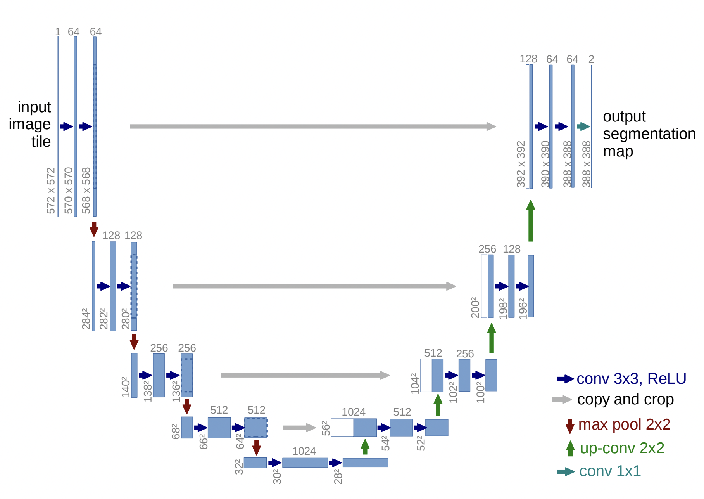

## UNET Papaer Walthrough

 

Outperformed the prior best method on the ISBI challenge for esegmentation of neuronal structures in electron microscopic stacks.

Typically, convolutional netowkrs are used for classification tasks. However in many visual tasks, the desired output should include localisation, a class label is assigned to each pixel.

<a href="https://proceedings.neurips.cc/paper/2012/file/459a4ddcb586f24efd9395aa7662bc7c-Paper.pdf">Other approaches were tried, but not as good anymore</a>

 

### UNET Architecture

- input
  - input is 1 572x572 image, 1 channel because grey scale
- output
  - output is 1 388x388 'segmentation map', 2 channels because 2 classes

The input and ouput size is different because the input is padded

Data flow
- 3x3 'valid' convolution
  - 'valid' meaning kernel fits perfectly over image, if the kernel matrix is smaller than the input matrix, the output matrix will be smaller than the input matrix
  - the valid convolution reduces the size of the input slightly (572 -> 570), (570 -> 568)
  - The number of filters is 64

 

- Downsample the input
  - Half the input with max pooling using kernel_size=2 and stride=2
  - 2 x 3 x 3 convs with valid padding (again)
    - The number of channels is doubled again

 
- Upsampling
  - similar to downsampling
  - with skip connections

 

The UNET increases the 'receptive field' by flattening out the data in downsampling. The receptive field increases faster than convolutions performed in sequence

 

During downsampling (contraction path)
- learning what? -> learning to summarise what is in the image, but spacial information is being lost.

During upsampling
- learning where
- skip connections provide valuable location information
- skip connection information is cropped to match the size of the upsampled block

UNET builds upon the<a href="https://arxiv.org/pdf/1411.4038.pdf">"fully convolutional network"</a>. UNET adds successive layers, where pooling operators are replaced by upsampling operators. To localise, high resolution features from the contracting path are combined with the upsampled output. A successive convolution layer can then learn to assemble a more precise output based on this information.

 

In the architecture, the upsampling has a large number of feature channels, which allow the network to proagate context information to higher resolution layers.

 

The network does not have any fully connected layers and oly uses the valid part of each convolution.

<!--   -->